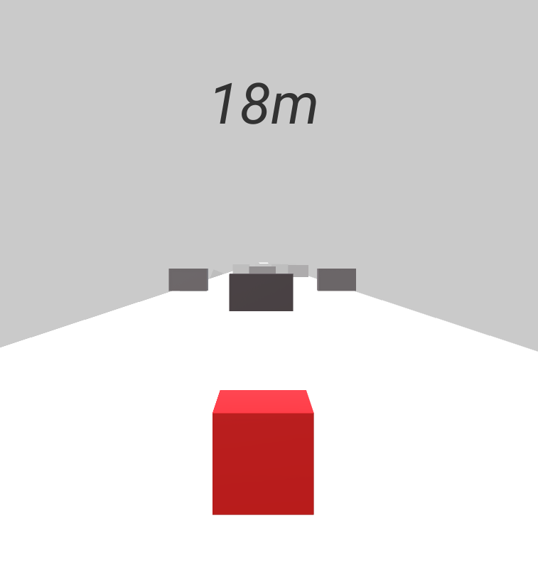
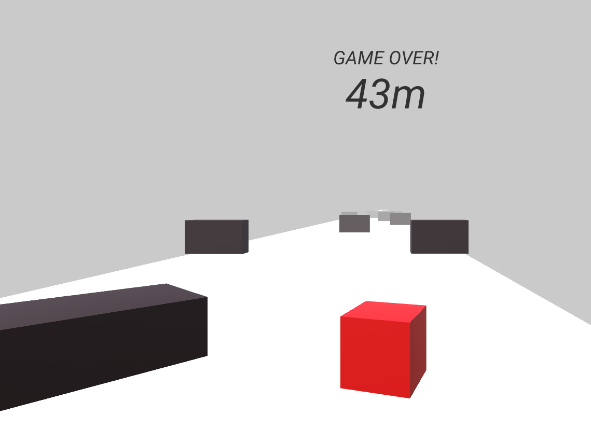
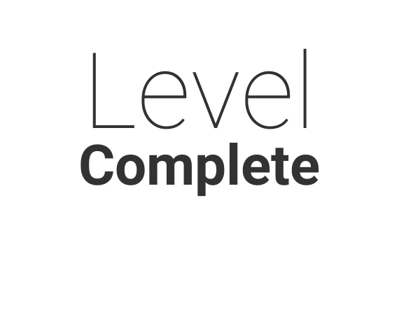

# UnityCubeRunGame
An arcade game in which we drive a cube and have to avoid obstacles to reach the end of the level.

## Table of Contents
* [General Info](#general-information)
* [Technologies Used](#technologies-used)
* [Features](#features)
* [Screenshots](#screenshots)
* [Usage](#usage)
* [Project Status](#project-status)
* [Room for Improvement](#room-for-improvement)
* [Acknowledgements](#acknowledgements)

## General Information
- Game It was created in order to learn the graphical game development engine
- This is a good way to learn to create 3D objects in a graphics program environment such as Blender

## Technologies Used
- [Unity Engine](https://unity.com/) - version 2020.1.1f1
- [Blender](https://www.blender.org/) - version 2.92.0

## Features
- The ability to control the cube
- Certain victory conditions
- Collisions with other objects on the level map

## Screenshots

## Setup
Download unity to run the application code

## Usage
Use the "a", "w", "s", "d" keys to control the cube and avoid obstacles lurking on the map

## Project Status
The project is not further developed. However, it has potential as a base for future game development project in the Unity engine

## Room for Improvement

To do:
- Adding tests
- More levels with more advanced physics
- Better graphic design in order to improve the quality of using the application

## Acknowledgements
- This project was based on [this tutorial](https://www.youtube.com/playlist?list=PLPV2KyIb3jR53Jce9hP7G5xC4O9AgnOuL).
